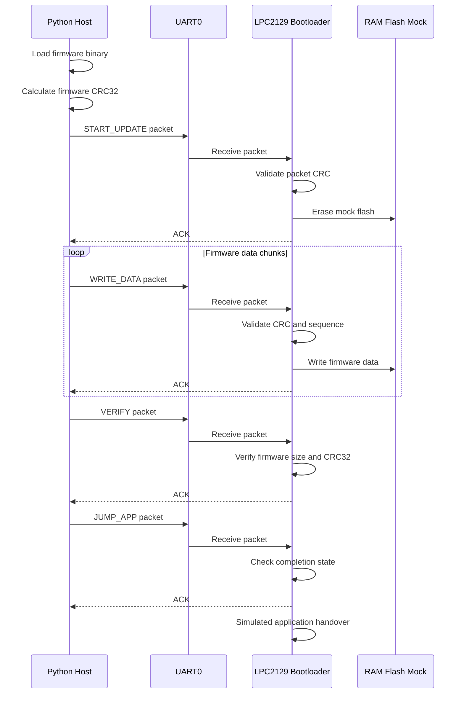

# Firmware Update Sequence

This diagram illustrates the firmware update process between the Python host application and the LPC2129 bootloader.

```mermaid
sequenceDiagram
    participant Host as Python Host
    participant UART as UART0
    participant BL as LPC2129 Bootloader
    participant Flash as RAM Flash Mock

    Host->>Host: Load firmware binary
    Host->>Host: Calculate firmware CRC32

    Host->>UART: START_UPDATE packet
    UART->>BL: Receive packet
    BL->>BL: Validate packet CRC
    BL->>Flash: Erase mock flash
    BL-->>Host: ACK

    loop Firmware data chunks
        Host->>UART: WRITE_DATA packet
        UART->>BL: Receive packet
        BL->>BL: Validate CRC and sequence
        BL->>Flash: Write firmware data
        BL-->>Host: ACK
    end

    Host->>UART: VERIFY packet
    UART->>BL: Receive packet
    BL->>BL: Verify firmware size and CRC32
    BL-->>Host: ACK

    Host->>UART: JUMP_APP packet
    UART->>BL: Receive packet
    BL->>BL: Check completion state
    BL-->>Host: ACK
    BL->>BL: Simulated application handover
```
